<!-- TOC start (generated with https://github.com/derlin/bitdowntoc) -->

- [AQI Buddy](#aqi-buddy)
- [Background](#background)
- [Pre-requisites](#pre-requisites)
- [Materials Needed](#materials-needed)
- [Tools Needed](#tools-needed)
- [Build Guide](#build-guide)
  - [1 - 3D Print the Case](#1---3d-print-the-case)
  - [2 - Building the Circuit!](#2---building-the-circuit)
  - [3 - Upload Code to Wio Terminal](#3---upload-code-to-wio-terminal)
  - [4 - Final Assembly](#4---final-assembly)
- [Things I Learned and Improvement Considerations](#things-i-learned-and-improvement-considerations)
- [References](#references)

<!-- TOC end -->

<!-- TOC --><a name="aqi-buddy"></a>

# AQI Buddy
AQI Buddy is a minimal air quality display using a Wio Terminal and Plantower PMS503. It is designed to be portable so you can measure the air quality anywhere you go. For example, the air quality when cooking, driving on the highway, outdoors, indoors, etc.

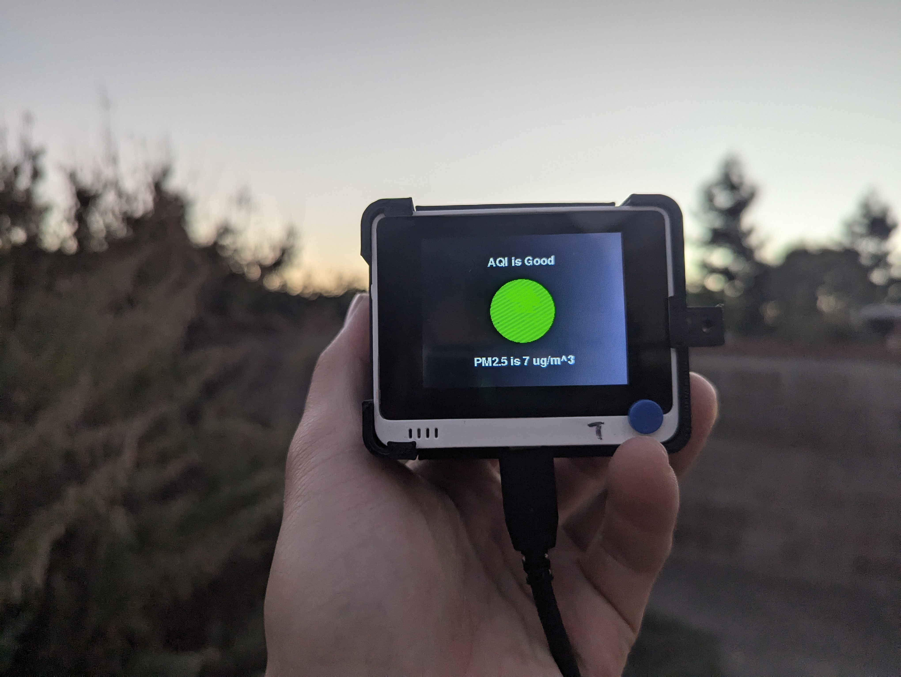

# Background
Air Quality Index (AQI) meausre PM2.5 to help determine the air quality and impacts to human health. According to [World Air Quality Index Project](https://aqicn.org/calculator/), the US EPA standard for AQI is:

| AQI       | Air Pollution Level            | PM 2.5    |
| --------- | ------------------------------ | --------- |
| 0 - 50    | Good                           | 0 - 12    |
| 51 - 100  | Moderate                       | 13 - 35   |
| 101 - 150 | Unhealthy for Sensitive Groups | 36 - 56   |
| 151 - 200 | Unhealthy                      | 57 - 150  |
| 201 - 300 | Very Unhealthy                 | 151 - 199 |
| 300+      | Hazordous                      | 200 +     |

# Pre-requisites
- [ ] Soldering Skills
- [ ] Git
- [ ] [PlatformIO](https://platformio.org/)
- [ ] [Visual Studio Code](https://code.visualstudio.com/)

# Materials Needed
- [ ] [Wio Terminal](https://www.seeedstudio.com/Wio-Terminal-p-4509.html)
- [ ] PLA Filament for 3D Printer
- [ ] [M3 8MM Hex Screws](https://www.amazon.com/dp/B07CMQ1SQH)
- [ ] [M3x4x5mm Threaded Inserts](https://www.amazon.com/dp/B0CNVXWQYZ)
- [ ] M3 Nut
- [ ] Solder
- [ ] Male Header Pins
- [ ] Solid Electrical Wire
- [ ] USB-C Cable
- [ ] (Optional for Mobility) USB Power Bank

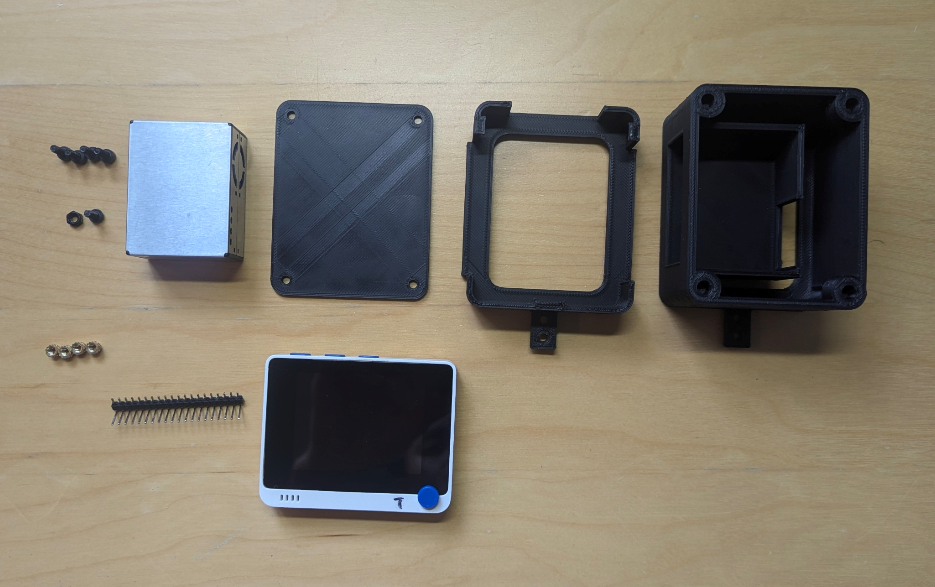

# Tools Needed
- [ ] 3D Printer
- [ ] Hex Key
- [ ] Soldering Iron

# Build Guide
Follow all these steps below to setup your on AQI Buddy 😁.

## 1 - 3D Print the Case
1. Print the following components
 2. [aqi_buddy_body.stl](./stl/aqi_buddy_body.stl) - this takes the longest
 3. [aqi_buddy_lid.stl](./stl/aqi_buddy_lid.stl)
 4. [aqi_buddy_wio.stl](./stl/aqi_buddy_wio.stl)
2. Add the 4 threaded inserts to the holes in **aqi_buddy_body.stl** with a soldering iron

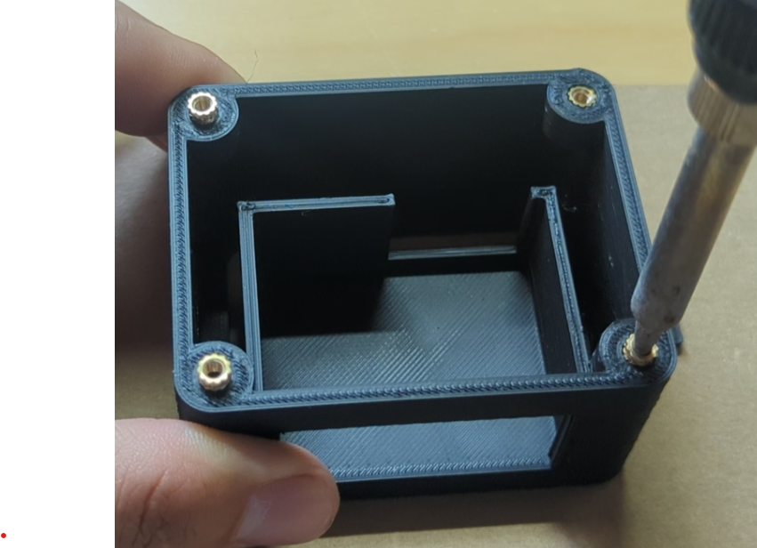

I'm personally not great at CAD, so I am sharing this Onshape link if you want to improve the design yourself 😅: [okyang_aqi_buddy][onshape link]


## 2 - Building the Circuit!
Solder the male header pins to the aqi sensor breakout board using the circuit diagram below:
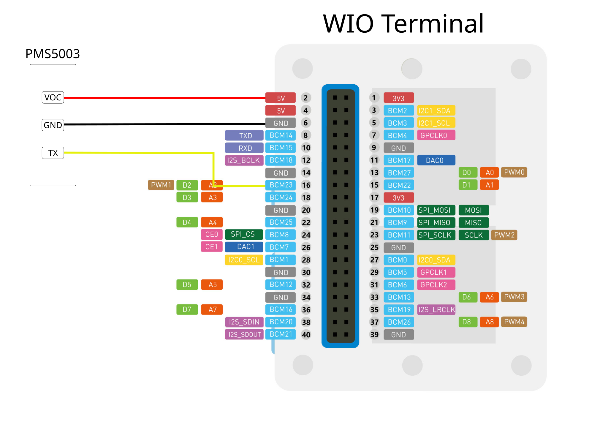

1. Plug in the male headers to the left side of wio terminal socket
2. Solder your wires to the AQI sensor breakout board

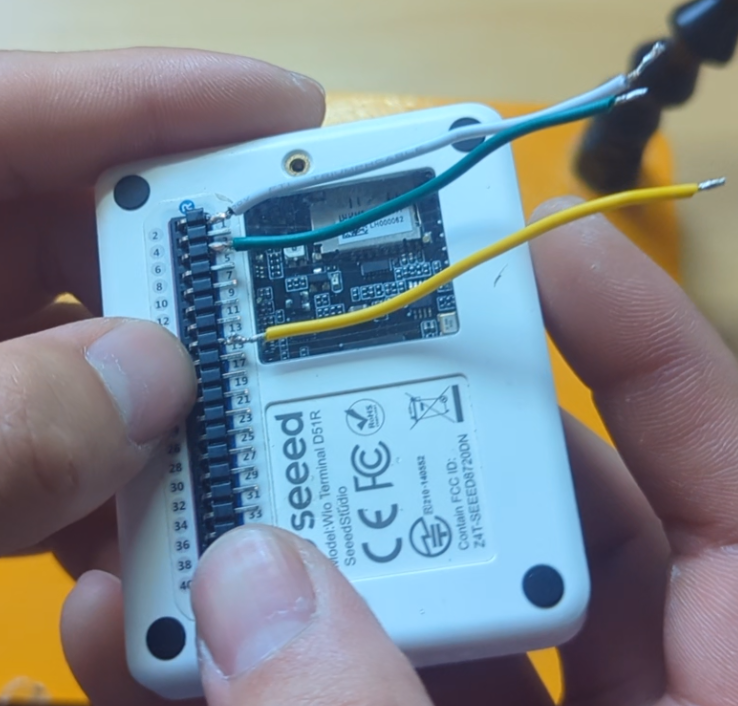

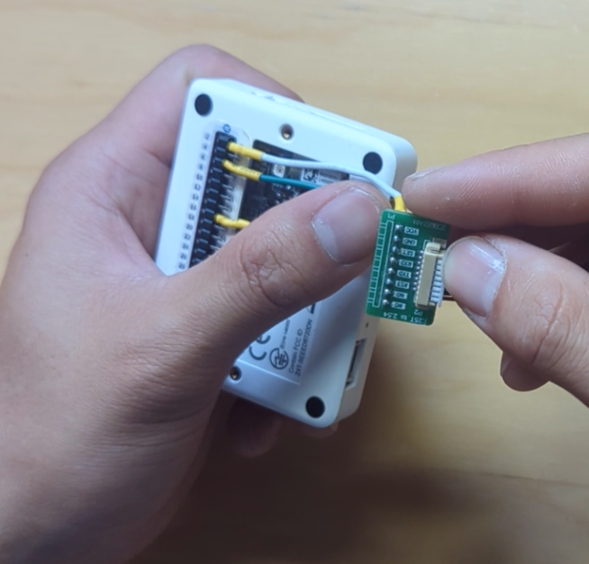

## 3 - Upload Code to Wio Terminal
1. Clone this repo
    ```shell
    git clone git@github.com:okyang/aqi_buddy.git
    ```
2. Pull necessary submodules
    ```shell
    git submodule update --init --recursive
    ```
3. Plug in your wio terminal
4. Upload the code

## 4 - Final Assembly
1. Place Wio Terminal in the Top side of the **aqi_buddy_wio** and feed the connection to the AQI sensor breakout board through the rectangular opening
2. Add in the **aqi_buddy_body** and align with the rectangular tab on the **aqi_buddy_wio**
3. Secure the **aqi_buddy_wio** by threading through a M3 screw to the closer hole and secure with a M3 nut
4. Slide in the AQI sensor to the **aqi_buddy_body** with the fan facing towards the opening (very important!)
5. Connect the cable from the AQI sensor breakout board to the AQI sensor
6. Finally, add the **aqi_sensor_lid** and screw in the four M3 screws

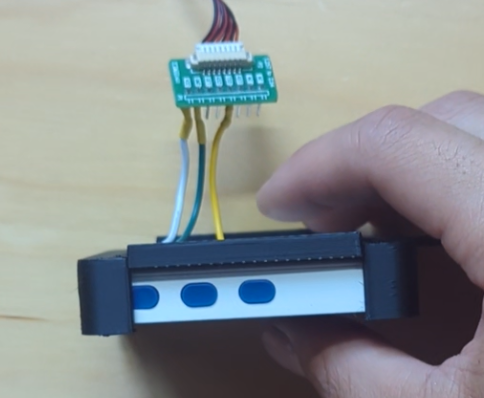

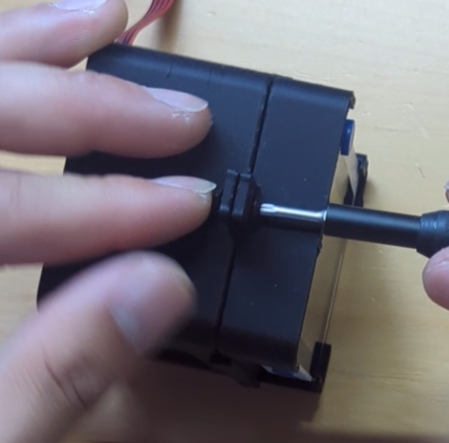

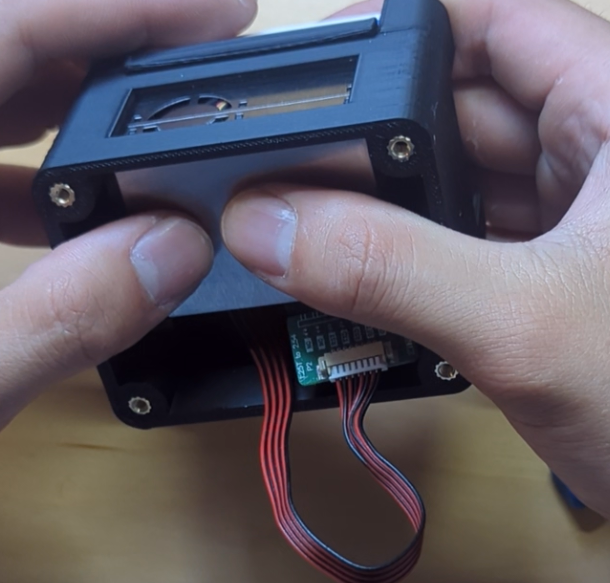

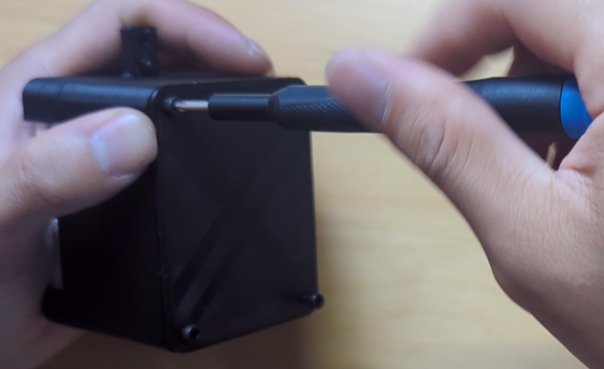

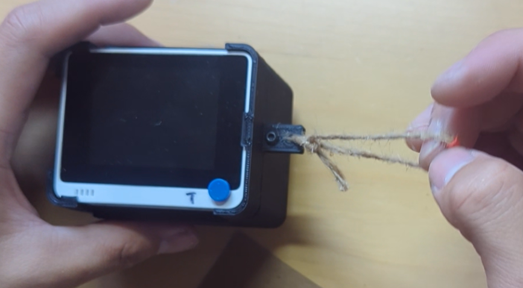

# Things I Learned and Improvement Considerations
I am still a novice at CAD design, but I feel like there was so many little things I learned like how to use [variables](https://cad.onshape.com/help/Content/variable.htm) for my sketches, getting more familiar with the various tools in [Onshape](https://www.onshape.com/en/), and learning how to assemble parts together. This is probably very trivial to others, but not for me 😅.

I already knew some of this before, but setting up a Github Actions Workflow was very cool to see. I added a basic check that basically just compiles to code after each commit. This is definitely a very handy feature and very simple check make sure I didn't break the code for others.

Also, using [git submodules](https://git-scm.com/book/en/v2/Git-Tools-Submodules) was not a new concept to me, but definitely not something I used often. I used it in this project because of the dependencies on `Adafruit_BusIO` and  `Adafruit_PM25AQI`. I just thought this was a handy feature of git that other novice developers should know about as well.

The basic scope of the project seemed very simple, but I still feel like there is a lot of cool features that can be added. So for now to avoid [scope creep](https://www.forbes.com/advisor/business/scope-creep/), I will just write them down:
- Upload AQI Data to Influx Data or some IoT Dashboard
- Add a GPS, to collect location data (for a more mobile aqi sensor)
- Solar Powered + Weatherproof to mount the sensor outdoors
- Improve UI with [LVGL](https://lvgl.io/)
- Add an emotional character for each AQI level

# References
- [Wio Terminal Getting Started](https://wiki.seeedstudio.com/Wio-Terminal-Getting-Started/) - documentation for the Seeed studio wio terminal
- [Adafruit PM2.5 Sensor Quality Overview](https://learn.adafruit.com/pm25-air-quality-sensor/overview)
- [Adafruit PM25AQI Library](https://github.com/adafruit/Adafruit_PM25AQI)
- [PLANTOWER Datasheet](https://cdn-shop.adafruit.com/product-files/3686/plantower-pms5003-manual_v2-3.pdf)
- [Onshape CAD Design][onshape link] - CAD design for if you want to make any modifications to the case design

[onshape link]: https://cad.onshape.com/documents/0d690de565054810b2f57071/w/88b510ec140bf21b366c8841/e/53b255aacbf68a856bd73344?renderMode=0&uiState=668b170cd1791a4369f3bf3d
