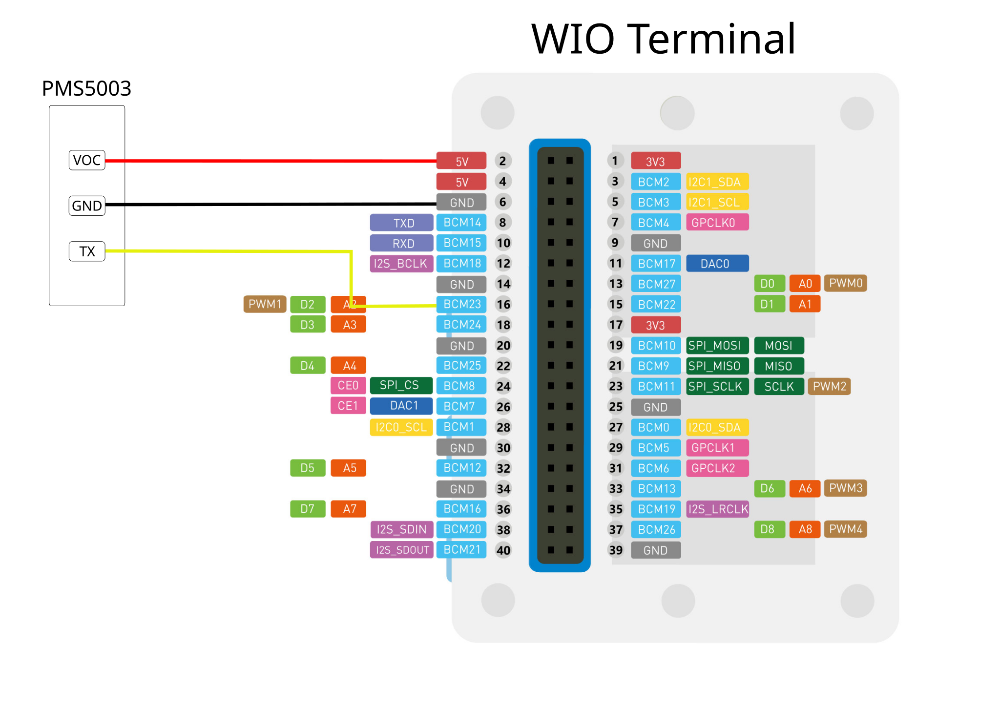

# Setup
```
git submodule update --init --recursive
```

# Background
Air Quality Index (AQI) meausre PM2.5 to help determine the air quality and impacts to human health. According to [World Air Quality Index Project](https://aqicn.org/calculator/), the US EPA standard for AQI is:

| AQI | Air Pollution Level | PM 2.5 |
| 0 - 50 | Good | 0 - 12 |
| 51 - 100 | Moderate | 13 - 35 |
| 101 - 150 | Unhealthy for Sensitive Groups | 36 - 56 |
| 151 - 200 | Unhealthy | 57 - 150 |
| 201 - 300 | Very Unhealthy | 151 - 199 |
| 300+ | Hazordous | 200 + |

# Circuit Diagram


# References
- [Wio Terminal Getting Started](https://wiki.seeedstudio.com/Wio-Terminal-Getting-Started/) - documentaiton for the Seeed studio wio terminal
- [Adafruit PM2.5 Sensor Quality Overview](https://learn.adafruit.com/pm25-air-quality-sensor/overview)
- [Adafruit PM25AQI Library](https://github.com/adafruit/Adafruit_PM25AQI)
- [PLANTOWER Datasheet](https://cdn-shop.adafruit.com/product-files/3686/plantower-pms5003-manual_v2-3.pdf)